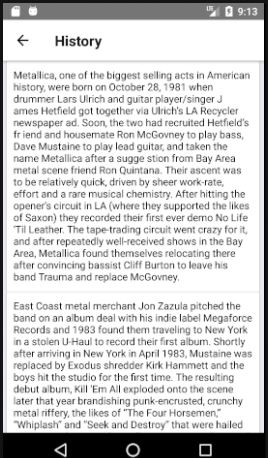

# Album

Aplicacion que muestra los albunes y conciertos de la banda Metallica!

## Correr la aplicacion

Para correr la aplicacion se debe introducir el siguiente comando.

```
react-native run-android
```

## Realizacion de la aplicacion

Para la realizacion de esta aplicacion utilice la documentacion oficial de react native
y mucha informacion en la web relacionado con la programacion por componentes y configuracion
del entorno de trabajo.

## Base de datos

Se hizo uso de la platforma firebase para la creacion del login inicial ya que mantiene
la seccion conforme se mueve sobre las interfaces pero no consulta usuarios de alguna base de datos.

## Como hacer login

Para iniciar sesion se deben llenar los campos de la siguiente forma:

email : se debe digita de la siguiente forma ( cualquiera@cualquiera.com )

password: cualquier palabra que contenga mas de seis letras

## Consumiendo datos

Para el consumo de datos de los albumns se creo un servicio en node js el cual se 
subio a heroku para su respectivo llamado de informcion. la Url es la siguiente

http://almundo-test.herokuapp.com/api/albums

La informacion para los albunes se almaceno en mLab, que es un servicio para base de datos moongoDB en la nube.

## Capturas de pantalla



